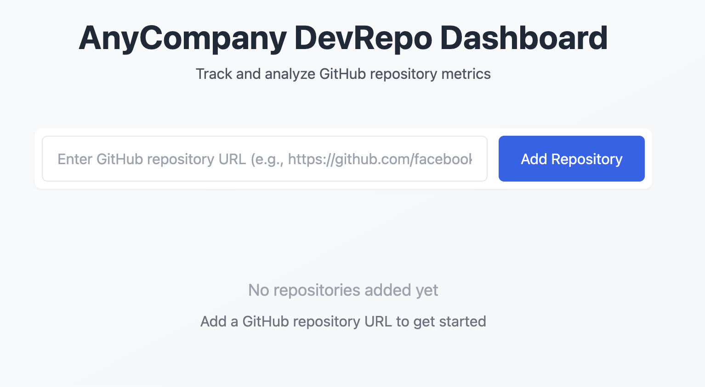

# GitHubMetrics - Frontend

This project was created as a demo for the simple deployment of [Railway](https://railway.com/). 
This project was bootstrapped with [Create React App](https://github.com/facebook/create-react-app).

## Overview

GitHubMetrics is a web application that allows users to track and analyze GitHub repository metrics. The application provides a simple and intuitive interface for:

- Adding GitHub repositories via their URLs
- Displaying repository information including:
  - Repository name
  - Main programming language
  - Date added to tracking
- Real-time status updates and error handling
- Responsive grid layout for multiple repository cards

### Technical Stack

The frontend is built with:
- React.js for the UI components and state management
- Axios for API requests
- Tailwind CSS for styling and responsive design
- Environment variables for flexible API configuration

### Features

- **Repository Management**: Users can add new repositories by entering their GitHub URLs
- **Real-time Updates**: The UI updates automatically when repositories are added
- **Error Handling**: Clear error messages for failed operations
- **Responsive Design**: Adapts seamlessly to different screen sizes
- **Modern UI**: Clean and intuitive interface with hover effects and loading states

### API Integration

The frontend connects to a backend API that:
- Handles repository URL validation
- Fetches repository metadata from GitHub
- Stores repository information in a database
- Provides endpoints for adding and retrieving repositories

The API URL can be configured via the `REACT_APP_API_URL` environment variable, defaulting to `http://localhost:3000` for local development.

## Available Scripts

In the project directory, you can run:

### `npm start`
Runs the app in development mode at [http://localhost:3000](http://localhost:3000)

### `npm test`
Launches the test runner in interactive watch mode

### `npm run build`
Builds the app for production in the `build` folder

### `npm run eject`
⚠️ **One-way operation** - Ejects from Create React App to expose all configs